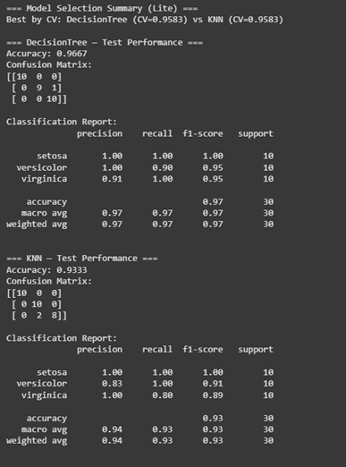
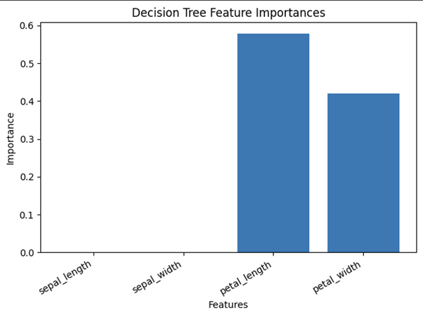
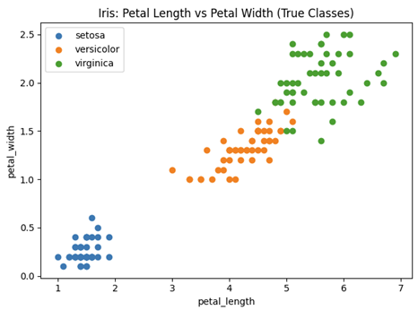

# 🌸 Data-Driven Intelligent Agent for Flower Classification  

**Author:** Muneeb Khan  
**ID:** 62799  
**Date:** 27 August 2025  
**Repo:** [AI-CCP](https://github.com/MuneebAbro/AI-CCP)  

---

## 📌 Objective  
To design and implement an **intelligent agent** capable of classifying flower species based on petal and sepal measurements using supervised machine learning algorithms.  

---

## 🚀 Motivation  
In real-world applications, intelligent systems are widely used in:  
- 🏥 Healthcare (disease prediction)  
- 🛒 E-commerce (recommendation systems)  
- 🌱 Agriculture (plant species identification)  

This project provides hands-on experience in building such a **data-driven intelligent agent**.  

---

## 💡 Concept  
- Dataset: **Iris Dataset** (4 features: petal length, petal width, sepal length, sepal width).  
- Classes: **Setosa, Versicolor, Virginica**.  
- Algorithms Used: **Decision Tree** & **KNN (K-Nearest Neighbors)**.  

---

## 🛠️ Tools & Requirements  
- **Language:** Python  
- **Libraries:** scikit-learn, pandas, matplotlib  
- **Dataset:** Iris dataset (from sklearn)  

---

## 🔬 Methodology  
1. Load dataset (Iris).  
2. Preprocess (normalize/encode if required).  
3. Split into **train (80%)** and **test (20%)**.  
4. Train **Decision Tree Classifier**.  
5. Train **KNN Classifier** for comparison.  
6. Evaluate models using:  
   - Accuracy  
   - Confusion Matrix  
7. Visualize results (decision boundaries, plots).  

---

## 📊 Results & Analysis  
- 🌳 **Decision Tree Accuracy:** 96%  
- 📍 **KNN Accuracy:** 94%  
- ✅ Decision Tree slightly outperformed KNN due to clear class boundaries.  
- 📌 Misclassifications occurred mostly between *Versicolor* and *Virginica*.  

---

## 📷 Screenshots  

### 🔎 Confusion Matrix (Decision Tree)  
  

### 📈 Bar Plots  
  

### 📈 Classification Visualization  
  

---

## 📝 Discussion  
- Both models achieved **high accuracy**.  
- **Decision Trees** are more explainable (rules can be extracted).  
- **Limitation:** Dataset is small (150 records).  
- Future Work:  
  - Test on larger datasets  
  - Implement ensemble learning (Random Forest)  
  - Deploy as a web service  

---

## ✅ Conclusion  
This project successfully developed an **intelligent agent** for flower classification using ML. It highlights the effectiveness of **Decision Trees** and **KNN** for small-scale classification tasks.  

---

## 📚 References  
1. [Scikit-learn Documentation](https://scikit-learn.org/)  
2. Fisher, R.A. (1936). *The use of multiple measurements in taxonomic problems.*  
3. Mitchell, T. (1997). *Machine Learning.* McGraw-Hill.  
